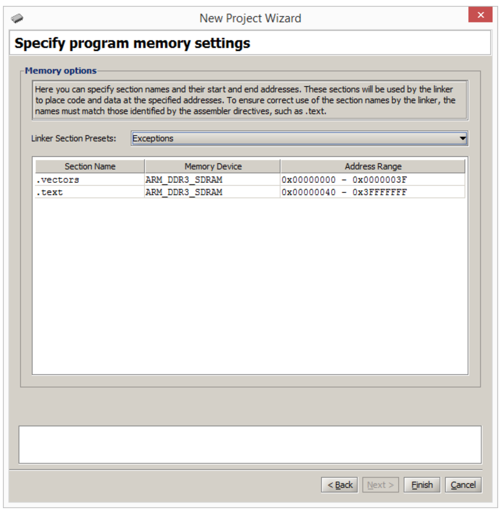

**COMP 231  Lab 5 - Interrupt Proccessing**

This lab consists of four subproblems. For each one, you will need to
write a short ARM assembly language program and create a matching Altera
Monitor Program project. You will submit your work with GitHub
Classroom. Your lab submission should consist of four folders named
`part1`, `part2`, etc.

The purpose of this assignment is to gain familiarity with interrupt
handling and more efficient device usage. You should turn in your work
using GitHub Classroom.

# Getting Started

Before you begin this section, you should read through the following
documents that are on Canvas and provide important information about the
environment and hardware that you will be using for this lab.
Specifically:

- **DE10-Standard Computer System** -- this document covers the various
  hardware on the system. You will need to understand how to use the
  interrupt controller, timers, key buttons, LEDs, and seven-segment
  displays. This document is mostly for reference.

- **Using the ARM Generic Interrupt Controller** -- this document
  details the specifics of how interrupts work on the ARM system as well
  as the interrupt controller hardware. You will need to understand this
  document fairly well to complete this lab. You can skip the sections
  that focus on assembly language.

This program will involve a new way for software and hardware to work
together. Rather than having loops that check device registers to see if
something has happened, we can program many devices to generate
*interrupts* when their status has changed. This frees up the CPU to
work on other things or go to sleep, while waiting for an event. All of
your programs in this assignment will use an *interrupt vector*, which
is a block of function calls stored *before* the program code. They must
be located here in order for the CPU to find the functions that should
be called when an interrupt happens.

For the first part of this project, we will be starting off by taking a
sample program that is provided by the Monitor Program and modifying it
slightly. The sample program sets up the system to generate interrupts
when a key button is pressed and to light up the corresponding LED
light.

You should first spend some time looking through the `gic_example`
folder to understand how to use the GIC to setup and handle interrupts.
You should not start working on the programming components without
having a good understanding of this example. The project contains the
following files:

1.  **main.s** -- this file contains three important components

    1.  **interrupt vector** -- this section contains a fixed sequence
        of branch instructions that are used directly by the hardware
        when an interrupt is received. In particular, the `service_irq`
        function is the main handler we will use to deal with general
        hardware interrupts (as opposed to problem interrupts and
        priority interrupts)

    2.  **\_start** -- this is the `main()` function which configures
        interrupt handling and initializes the stack pointers for the
        different CPU modes. The CPU has separate stack pointers for
        different operating modes (user, supervisor, interrupts).
        **NOTE:** this code also contains code to tell the KEY device to
        generate interrupts when pressed. This needs to be done for
        *each* device you are using with interrupts.

    3.  **service_irq()** -- this is the main function that is called
        when an interrupt has occurred. It is mostly responsible for
        checking to see which interrupt occurred and calling the handler
        for that type of interrupt. For this case, it only checks for
        keypress interrupts.

2.  **config.s** -- this file configures the GIC hardware for the
    interrupts that you want to handle in your programs. The example
    program only cares about the interrupts that will be generated when
    a pushbutton key is pressed.

    1.  **config_gic()** -- this function calls the next function,
        `config_interrupt()` for each device interrupt that we want to
        handle. After the per-device interrupts have been configured,
        the GIC itself is setup and configured to listen to interrupts
        and send them on to the CPU.

    2.  **config_interrupt()** -- this function takes an interrupt ID
        (see `interrupt_ID.s` and a CPU ID to forward to. We always
        forward interrupts to CPU0.

3.  **keyisr.s** -- this is the function that is called by
    `service_irq()`, above, when a keypress interrupt occurs. In this
    example code, we check the GPIO device register to see which button
    was pressed and light up the matching LEDs.

# Part 1 - Key Interrupts and Seven-Segment Displays

For this part of the assignment, start off by copying the assembly
source files from the example code into the `part1` directory. There is
already a file in the `part1` folder, `util.s`, which contains code to
deal with the seven-segment displays from previous labs. To start your
project open the Monitor Program, and head up to the Edit menu and
enable \"Source-Level Debugging\". Next go back to the File menu and
create a new project, as usual. You should add multiple assembly files
to this project (not all of them): ` main.s`, `config.s`, `keyisr.s`,
and `util.s`. Add them in that order.\
We also need to make a change to the project memory settings that is
different from our previous projects. We need to tell the CPU that we
are using interrupts and not to put the `_start()` function right at the
beginning of memory. On the page that looks like
Fig. 1.

<figure id="fig:newproject" data-latex-placement="h">

<figcaption>Project Memory Settings in the Monitor Program</figcaption>
</figure>

When you move through adding the project files, you should see the screen shown
in Fig. 1. It should be setup for *Exceptions*, which creates a short block at
the beginning of the computer memory that holds the *interrupt vector*. These
are the addresses of functions to jump to when the CPU receives an interrupt.\
The sample program waits for a key to be pressed, which causes an interrupt to
be sent to the CPU which calls the main interrupt handler, ` service_irq()`.
This function then calls the key interrupt handler, (`key_isr()`), the function
which turns on one of the LED lights.\ Your task for this part is to update the
`key_isr()` code to write the number of the key that was pressed to the first
seven-segment display. The first four seven-segment displays (SSD) are
controlled by writing a single 32-bit value to the address `HEX3_HEX0_BASE`,
the same as in previous labs.\ The four keys are numbered `KEY0, KEY1, KEY2,`
and `KEY3`. Update your program to light up a zero on the SSD when `KEY0` is
pressed, a one when `KEY1` is pressed, etc. You may use the helper functions in
`util.s` to generate the SSD patterns.

# Part 2 - Timer Interrupts

For the second part of this assignment, you will find some starter code
in the `part2` folder. Go back and look at the DE10 documentation in
Chapters 2 and 3 for information on the HPS Timer and using it with
interrupts. Your program will use the timer to generate an interrupt
every 0.25 seconds to increment a counter. Here are the specific things
you need to implement:

1.  Implement `config_hps_timer()` in `config.s`. You need to disable
    the timer, setup the timer, and the start the timer and its
    interrupts

2.  Add code to the `config_gic()` function to configure the GIC to
    listen for interrupts from the timer

3.  Update `service_irq()` to call `hpstimer_isr()` when an HPS timer
    interrupt is received

4.  Implement `key_isr()` to toggle (between 0 and 1) the value of the
    global variable `RUN` whenever any of the `KEY` buttons are pressed

5.  Implement `hpstimer_isr()` to increment the global variable `COUNT`
    by the value of `RUN` every time the timer interrupt is received

There are two global variables, `run` and `count`. In the main function,
the program executes an infinite loop that writes the value stored in
`count` out to the red LEDs every time through the loop. When a timer
interrupt is received, the timer ISR should increment `count` by the
value stored in `run`, which will either be zero or one.\
When any of the `KEY` buttons are pressed, you should toggle the value
in `run`. This has the effect of pausing the timer display. When `run`
is 1, the LEDs should show a count on the red lights that increments
every 0.25 seconds. Otherwise, the red LEDs should display a static
count value. The program should begin with the timer paused.\
Create a new project file called `part2`, add the `main.s`, ` config.s`,
and `isr.s` files and make sure to use the Exceptions memory setup. Once
your timer code is working, you can move to the next part.

# Part 3 - Variable Speed Timer Interrupts

Start this part by copying the `.s` files from `part2` to the ` part3`
folder. In this step, you will be adding functionality to change the
speed of the counter with the `KEY` buttons. You should create a new
global variable, `SPEED`, to track the current speed of the counter. As
before, initially the counter should increment every 0.25 seconds.\
Modify your program to use only $KEY_0$ to start/stop the timer. When
$KEY_2$ is pressed, the timer speed should double and when $KEY_1$ is
pressed, the timer speed should be halved. Move onto the next section
when you have a program with a variable speed timer fully functioning,

# Part 4 - Multiple Interrupt Sources

In this part, we will add another timer source to the program, the A9
Private Timer. This timer should be configured to interrupt every
$1/100^{th}$ of a second. Every time this timer goes off, you will
calculate a value that can be displayed on the seven-segment displays to
show the time in **SS:DD** format, where `SS` is seconds, and `DD` is
hundredths of seconds. This timer can be stopped and started by using
the $KEY_3$ button.

Start by copying your program from `part3`. Modify your code to
configure the GIC to listen for interrupts from the A9 private timer.
You should also create a new function, `config_private_timer()`, which
should be called from `_start()` and initializes the timer.\
You will need to add four additional global variables, `rtrun`, `time`,
and `hexcode3_0` in `main.s`. The `rtrun` variable is used to toggle
counting on/off. The `time` global is used to store the current time
(you can use this 32-bit value however you'd like to store the time).
The last two globals, should be properly formatted bit string patterns
that will be written directly to the seven-segment displays (in the main
loop, similar to part 1). These should be updated every time the timer
interrupt goes off. There are helper functions for the seven-segment
displays in `util.s`.\
Lastly, update the `main()` loop so that the `HEX_3_0` device is updated
with the corresponding pattern in the global variables. Make a new
monitor program project and test your program until both timers work
properly. You should also verify that your timer is relatively accurate
(i.e. your timer should show approximately 60 seconds when one minute of
actual time has elapsed.
